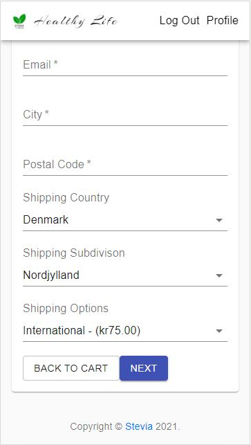

# STEVIA STORE

En e-handel butik för stevia producter.
Javascript Ramverk (React),
State hantering (React context),
Backend och produkter hantering (Commercejs),
Styles Framework (Material-ui),
Betalning System (stripe).

## Built With


- [React JS](https://reactjs.org/);
- [Commerce JS](https://commercejs.com/);
- [Material-UI](https://material-ui.com/);
- [Stripe](https://stripe.com/en-se);

## Running Locally

```bash
$ git clone https://github.com/Khaled85abo/Stevia.git
$ cd stevia
$ npm install
$ npm start
API keys are required
```

<h4>Firebase Authentication</h4>
<div>


</div>

# MOBILE

## Main Page / Single Product Page / Cart / Shipping Info

<div>



</div>

## Payment / Confirmation / More Info About The Order

<div>


</div>

## Email Sent To Amdin About the Order.


## Email Sent To Customer About the Order.


## More Info About The Order In Commerce.js console.


# DESKTOP

## Main Page.


## Single Product Page.


## Cart.


## Shipping Info.


## Payment.


## Confirmation.


## More Iformation About the Order.


